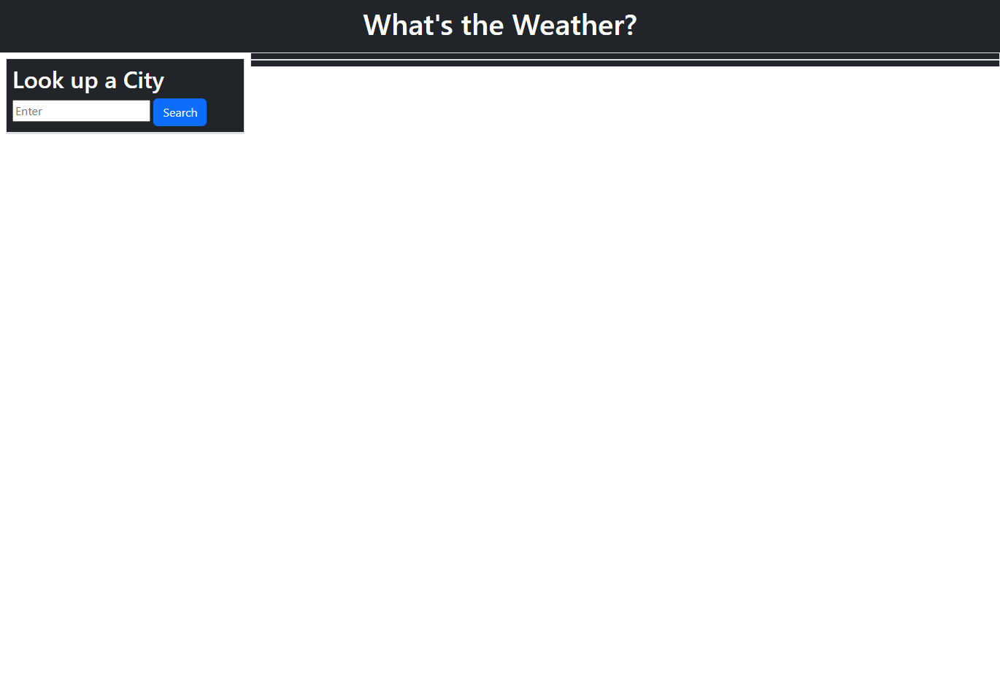

## Weather Dashboard

# Description

The goal of this web application is to use the open weather API to display a 5 day forecast for the desired city. The dashboard will save past searches, provide certain weather information, and display an icon according to the weather conditions.

In its current state, the application is unfinished. However, future develpment will include full functionality of the application.

# Technologies Used

* HTML
* JavaScript
* jQuery and dayjs
* Open Weather API

# Links

[Repository](https://github.com/n810tran/weather-dashboard/)

[Deployed Site](https://n810tran.github.io/weather-dashboard/)

# Preview

